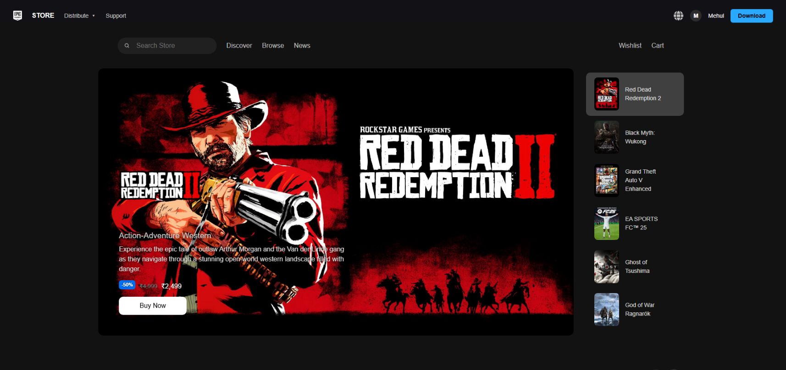
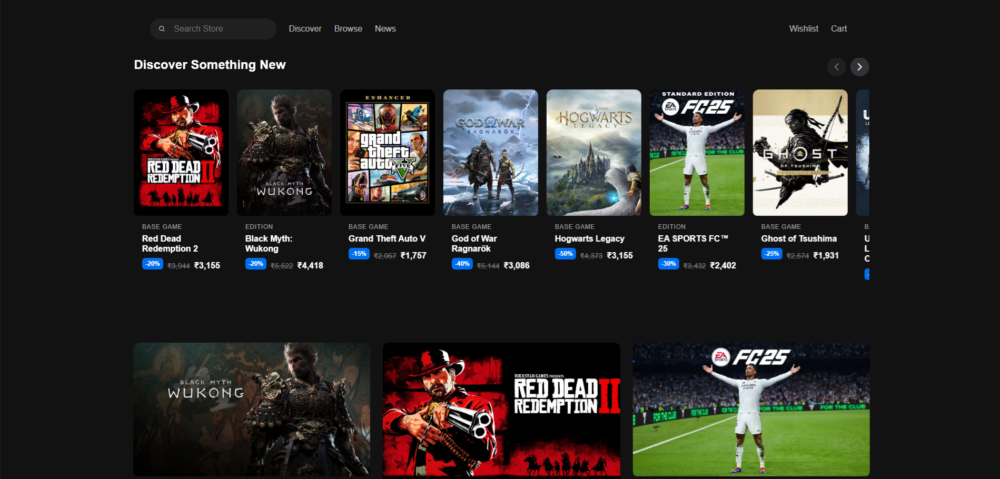
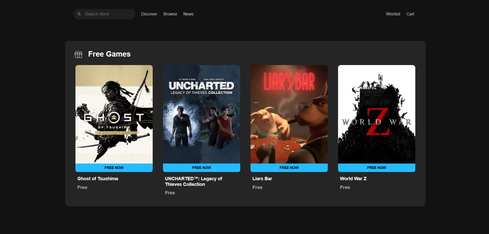
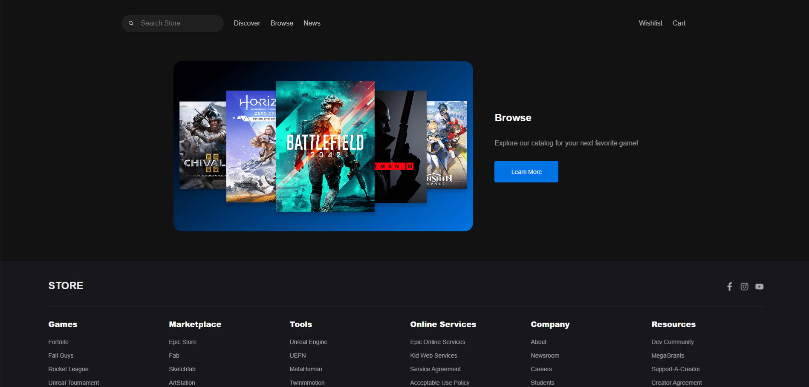

<h1 align="center">🎮 Epic Games Clone</h1>

<p align="center">
  <b>A sleek, responsive clone of the Epic Games Clone</b><br/>
  Built with modern frontend technologies like React and CSS for a smooth user experience.
</p>

<p align="center">
  
  
  
</p>

## 🚀 Features

- 🎮 **Epic Games Clone**
  - Featured games carousel
  - Free game highlights
  - Browse more section
- 🧭 Fully responsive layout
- ⚡ Lightning-fast build with **Vite**
- 🧩 Clean component-based architecture with React
- 🌐 Hosted live on Vercel

## 🔗 Live Preview

Check out the app here: [Epic Games Store Clone](https://epic-games-store.vercel.app)

## 📸 Screenshots

<p align="center">
  
</p>

<p align="center">
  
</p>

<p align="center">
  
</p>

<p align="center">
  
</p>

## 📦 Installation

1. **Clone the Repository**
```bash
git clone https://github.com/mehulkumar22/Epic-Games-Clone.git
cd Epic-Games-Clone
````

2. **Install Dependencies**

```bash
npm install
```

## ▶️ Running the App

```bash
npm run dev
```

## 📁 Folder Structure

```
Epic-Games-Clone/
├── 📁public
│   └── 📁img
│       ├── browser-logo.svg
│       ├── epic-games-logo.svg
│       ├── gift.svg
│       └── logo.png
├── 📁src
│   ├── App.jsx
│   ├── App.css
│   ├── index.css
│   ├── main.jsx
│   ├── 📁assets
│   ├── 📁data
│   ├── 📁pages
│   └── 📁components
│       ├── BrowseMore/
│       ├── FeaturedGameCard/
│       ├── FeaturedGameCard2/
│       ├── Footer/
│       ├── FreeGamesCard/
│       ├── GameCards/
│       ├── GameCards2/
│       ├── HeroSlider/
│       ├── Navbar/
│       └── NavbarTwo/
├── .gitignore
├── eslint.config.js
├── index.html
├── package.json
├── package-lock.json
└── vite.config.js
```

## 📬 Contact Me

* 📧 **Email:** [mehulkumar.mk02@gmail.com](mailto:mehulkumar.mk02@gmail.com)
* 💼 **LinkedIn:** [Mehul Kumar](https://www.linkedin.com/in/mehulkumar22)
* 💻 **GitHub:** [mehulkumar22](https://github.com/mehulkumar22)

## 🙌 Contributing

Feel free to fork this repo, submit issues, or open pull requests. Contributions are welcome!
